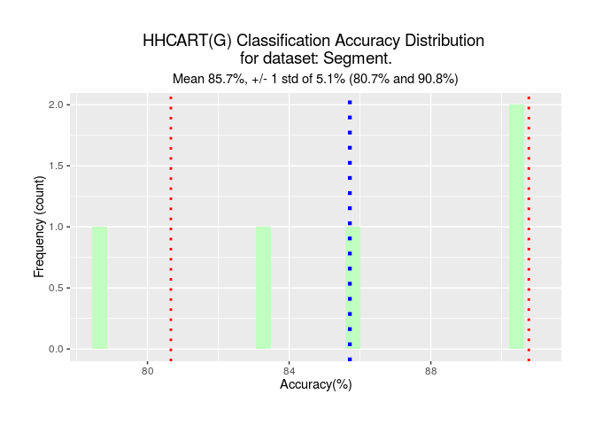
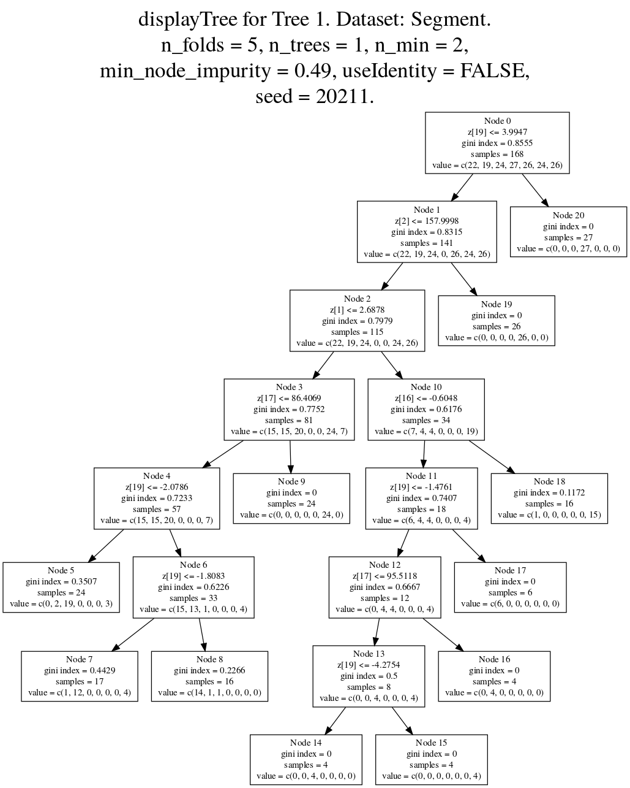

<!-- README.md is generated from README.Rmd. Please edit that file -->

# hhcartr

<!-- badges: start -->

<!-- badges: end -->

The goal of hhcartr is to provide an implementation in R of the
HHCART(G) algorithm. HHCART(G) is an oblique decision tree learning
algorithm. HHCART(G) combines learning concepts from two classification
tree algorithms, HHCART and Geometric Decision Tree (GDT). HHCART(G) is
a simplified HHCART algorithm that utilizes reflected feature spaces for
node splitting. Training examples are reflected to align linear
structure in the data with a coordinate axes. Searching axis-parallel
splits in this reflected feature space provides an efficient and
effective way of finding oblique splits in the original feature space.
This version of the package (v1.0.0) is a sequential R implementation
and is primarily a research tool. Future versions will introduce
parallelization using C++.

## Installation

~~You can install the released version of hhcartr from
[CRAN](https://CRAN.R-project.org) with:~~

``` r
~~install.packages("hhcartr")~~
```
And the development version from [GitHub](https://github.com/) with:

``` r
# install.packages("devtools")
~~devtools::install_github("kiwiphil/hhcartr")~~
devtools::install_github("ZiruiYan/hhcartr")
```

## Example

This is a basic example which shows you how to solve a common problem:

The first step is to load the dataset, then the feature variables X and
target variable y can be initialized. In the case of the segment
dataset, the X variable is created from columns 2-20 from the original
University of California, Irvine (UCI) Machine Learning Repository D. J.
Newman ([2007](#ref-Newman+Asuncion:2007)) dataset and y is created from
column 1.

``` r
library(hhcartr)
#> 
#> Attaching package: 'hhcartr'
#> The following object is masked from 'package:base':
#> 
#>     letters
## basic example code
data("segment", package = "hhcartr")
X <- segment$X
y <- segment$y
test_data <- segment$test_data
```

Once the dataset has been loaded, it is advisable to summarize the basic
dataset information.

``` r
dim(X)
#> [1] 210  19
names(X)
#>  [1] "REGION.CENTROID.ROW"  "REGION.PIXEL.COUNT"   "SHORT.LINE.DENSITY.5"
#>  [4] "SHORT.LINE.DENSITY.2" "VEDGE.MEAN"           "VEDGE.SD"            
#>  [7] "HEDGE.MEAN"           "HEDGE.SD"             "INTENSITY.MEAN"      
#> [10] "RAWRED.MEAN"          "RAWBLUE.MEAN"         "RAWGREEN.MEAN"       
#> [13] "EXRED.MEAN"           "EXBLUE.MEAN"          "EXGREEN.MEAN"        
#> [16] "VALUE.MEAN"           "SATURATION.MEAN"      "HUE.MEAN"            
#> [19] "X"
```

Before building the model, we need to prepare the training dataset,
specifically identifying the variables to ignore in the modelling.
Identifiers and any output variables should not be used (as independent
variables) for modelling. In the case of datasets supplied with hhcartr,
all appropriate variables are assigned to the X and y objects of the
dataset. Next, we deal with missing values. Currently, this
implementation of hhcartr does not support data with missing values. In
the supplied datasets with hhcartr, there are no missing values. It is
useful to review the distribution of the target variable.

``` r
table(y)
#> y
#> BRICKFACE    CEMENT   FOLIAGE     GRASS      PATH       SKY    WINDOW 
#>        30        30        30        30        30        30        30
```

We now instantiate the chosen model. The model aims to predict the
target based on all other variables. We will let the model choose the
best value for min\_node\_impurity using ten-fold cross-validation. We
also set a seed so that the results can be replicated.

``` r
model <- HHDecisionTree(min_node_impurity = "auto", seed = 20211)
```

We use function setDataDescription() to provide the data source for all
subsequent display command outputs. The dataDescription parameter of the
model HHDecisionTree() can also be used to provide a descriptive name
for the data source.

``` r
setDataDescription("Segment")
```

We are now ready to train the model by passing the feature variables (X
object) and the target variable (y object) to the model fit() function.

``` r
model.output <- model$fit(X, y)
#> [1] "Finding best min_node_impurity starting at 0.05, by steps of 0.01, for 50 values."
#> [1] "Using mni.control parameters n_folds-[10], n_trees-[1] for response-[classify]."
#> [1] "2021-06-29 09:01:30 HHDecisionTreeClassifier() Using seed = [20211]."
#> [1] "2021-06-29 09:01:41 HHDecisionTreeClassifier() Using seed = [20211]."
#> [1] "2021-06-29 09:01:51 HHDecisionTreeClassifier() Using seed = [20211]."
#> [1] "2021-06-29 09:02:02 HHDecisionTreeClassifier() Using seed = [20211]."
#> [1] "2021-06-29 09:02:13 HHDecisionTreeClassifier() Using seed = [20211]."
#> [1] "2021-06-29 09:02:23 HHDecisionTreeClassifier() Using seed = [20211]."
#> [1] "2021-06-29 09:02:33 HHDecisionTreeClassifier() Using seed = [20211]."
#> [1] "2021-06-29 09:02:42 HHDecisionTreeClassifier() Using seed = [20211]."
#> [1] "2021-06-29 09:02:53 HHDecisionTreeClassifier() Using seed = [20211]."
#> [1] "2021-06-29 09:03:02 HHDecisionTreeClassifier() Using seed = [20211]."
#> [1] "2021-06-29 09:03:12 HHDecisionTreeClassifier() Using seed = [20211]."
#> [1] "2021-06-29 09:03:22 HHDecisionTreeClassifier() Using seed = [20211]."
#> [1] "2021-06-29 09:03:32 HHDecisionTreeClassifier() Using seed = [20211]."
#> [1] "2021-06-29 09:03:41 HHDecisionTreeClassifier() Using seed = [20211]."
#> [1] "2021-06-29 09:03:50 HHDecisionTreeClassifier() Using seed = [20211]."
#> [1] "2021-06-29 09:03:59 HHDecisionTreeClassifier() Using seed = [20211]."
#> [1] "2021-06-29 09:04:07 HHDecisionTreeClassifier() Using seed = [20211]."
#> [1] "2021-06-29 09:04:16 HHDecisionTreeClassifier() Using seed = [20211]."
#> [1] "2021-06-29 09:04:25 HHDecisionTreeClassifier() Using seed = [20211]."
#> [1] "2021-06-29 09:04:33 HHDecisionTreeClassifier() Using seed = [20211]."
#> [1] "2021-06-29 09:04:42 HHDecisionTreeClassifier() Using seed = [20211]."
#> [1] "2021-06-29 09:04:50 HHDecisionTreeClassifier() Using seed = [20211]."
#> [1] "2021-06-29 09:04:58 HHDecisionTreeClassifier() Using seed = [20211]."
#> [1] "2021-06-29 09:05:06 HHDecisionTreeClassifier() Using seed = [20211]."
#> [1] "2021-06-29 09:05:14 HHDecisionTreeClassifier() Using seed = [20211]."
#> [1] "2021-06-29 09:05:22 HHDecisionTreeClassifier() Using seed = [20211]."
#> [1] "2021-06-29 09:05:30 HHDecisionTreeClassifier() Using seed = [20211]."
#> [1] "2021-06-29 09:05:37 HHDecisionTreeClassifier() Using seed = [20211]."
#> [1] "2021-06-29 09:05:43 HHDecisionTreeClassifier() Using seed = [20211]."
#> [1] "2021-06-29 09:05:50 HHDecisionTreeClassifier() Using seed = [20211]."
#> [1] "2021-06-29 09:05:57 HHDecisionTreeClassifier() Using seed = [20211]."
#> [1] "2021-06-29 09:06:04 HHDecisionTreeClassifier() Using seed = [20211]."
#> [1] "2021-06-29 09:06:10 HHDecisionTreeClassifier() Using seed = [20211]."
#> [1] "2021-06-29 09:06:18 HHDecisionTreeClassifier() Using seed = [20211]."
#> [1] "2021-06-29 09:06:26 HHDecisionTreeClassifier() Using seed = [20211]."
#> [1] "2021-06-29 09:06:33 HHDecisionTreeClassifier() Using seed = [20211]."
#> [1] "2021-06-29 09:06:41 HHDecisionTreeClassifier() Using seed = [20211]."
#> [1] "2021-06-29 09:06:48 HHDecisionTreeClassifier() Using seed = [20211]."
#> [1] "2021-06-29 09:06:55 HHDecisionTreeClassifier() Using seed = [20211]."
#> [1] "2021-06-29 09:07:02 HHDecisionTreeClassifier() Using seed = [20211]."
#> [1] "2021-06-29 09:07:09 HHDecisionTreeClassifier() Using seed = [20211]."
#> [1] "2021-06-29 09:07:17 HHDecisionTreeClassifier() Using seed = [20211]."
#> [1] "2021-06-29 09:07:24 HHDecisionTreeClassifier() Using seed = [20211]."
#> [1] "2021-06-29 09:07:30 HHDecisionTreeClassifier() Using seed = [20211]."
#> [1] "2021-06-29 09:07:37 HHDecisionTreeClassifier() Using seed = [20211]."
#> [1] "2021-06-29 09:07:43 HHDecisionTreeClassifier() Using seed = [20211]."
#> [1] "2021-06-29 09:07:50 HHDecisionTreeClassifier() Using seed = [20211]."
#> [1] "2021-06-29 09:07:57 HHDecisionTreeClassifier() Using seed = [20211]."
#> [1] "2021-06-29 09:08:03 HHDecisionTreeClassifier() Using seed = [20211]."
#> [1] "2021-06-29 09:08:09 HHDecisionTreeClassifier() Using seed = [20211]."
#> [1] "2021-06-29 09:08:14 HHDecisionTreeClassifier() Using seed = [20211]."
#> [1] "Maximum accuracy 100 found at the following min_node_impurity value 0.49. Seed 20211."
#> [1] "Returning min_node_impurity value 0.49."
#> [1] ""
#> [1] "2021-06-29 09:08:19 HHDecisionTreeClassifier() tree inference starts. Fold size=[42]."
#> [1] "2021-06-29 09:08:19 HHDecisionTreeClassifier() Using seed = [20211]."
#> [1] "2021-06-29 09:08:19 ***** Starting Fold 1 of 5. Tree 1 of 1."
#> [1] "2021-06-29 09:08:20 ***** Starting Fold 2 of 5. Tree 1 of 1."
#> [1] "2021-06-29 09:08:21 ***** Starting Fold 3 of 5. Tree 1 of 1."
#> [1] "2021-06-29 09:08:21 ***** Starting Fold 4 of 5. Tree 1 of 1."
#> [1] "2021-06-29 09:08:22 ***** Starting Fold 5 of 5. Tree 1 of 1."
#> [1] "2021-06-29 09:08:23 HHDecisionTreeClassifier() tree inference complete."
```

After the tree-building process has completed, results detailing
accuracy, the number of nodes and the number of leaves per tree can be
displayed for each fold by using the results() function.

``` r
res <- results(model.output)
#> [1] "HHDecisionTreeClassifier() : Run Statistics for Dataset: Segment"
#> [1] "using parameters:"
#> [1] "n_folds-[5]  n_trees-[1]  n_min-[2]  min_node_impurity-[0.49]"
#> [1] "sampleWithReplacement-[FALSE]  useIdentity-[FALSE]  testSize-[0.2]"
#> [1] "Mean Accuracy-[85.71] Mean Nodes-[20.6] Mean Leaves-[10.8]"
```

The accuracy reported here is the mean of the accuracies achieved on
each test fold. The size of a test fold is the number of training
samples / n\_folds. The accuracy method of the results object can be
used to display the accuracy, the number of nodes and the number of
leaves per tree for each fold. These are saved in a list and are
accessible for future plotting or analysis.

``` r
res$accuracy()
#> [[1]]
#>   Accuracy Number_of_Nodes Number_of_Leaves
#> 1    78.57              21               11
#> 2    90.48              19               10
#> 3    90.48              19               10
#> 4    83.33              19               10
#> 5    85.71              25               13
```

The min\_node\_impurity data generated when using min\_node\_impurity =
“auto” can be accessed using the mni\_data() method of the results
object. The mni\_data() method returns a data frame containing the fold
number, accuracy and number of leaves for each value of
min\_node\_impurity evaluated, which can can be saved as a variable. The
parameter options(max.print = 50) is used here to limit the output
display to the first few rows.

``` r
options(max.print = 50)
res$mni_data()
#>    fold  seed min_node_impurity accuracy number_of_leaves
#> 1     1 20211              0.05    80.95               24
#> 2     2 20211              0.05    85.71               18
#> 3     3 20211              0.05    80.95               19
#> 4     4 20211              0.05    90.48               21
#> 5     5 20211              0.05    95.24               22
#> 6     6 20211              0.05    85.71               22
#> 7     7 20211              0.05    85.71               25
#> 8     8 20211              0.05    85.71               31
#> 9     9 20211              0.05    71.43               21
#> 10   10 20211              0.05    85.71               22
#>  [ reached 'max' / getOption("max.print") -- omitted 500 rows ]
```

The print() function is used to visualize training accuracy results on a
histogram plot, the plot is rendered using ggplot2 Wickham
([2016](#ref-ggplot2)), also visualized is the mean±std.

``` r
print(model.output)
#> Loading required package: ggplot2
```

 The standard
predict() function is available to apply new data to the model. The
Segment dataset provides a 2,100 sample test dataset. Here we apply this
test dataset (loaded above) to obtain the mean prediction accuracy for
each fold. The predict() function supports both accuracy and predictions
methods.

``` r
preds <- predict(model.output , test_data = test_data)
#> [1] "Predicting on the Test data of the Segment dataset..."
#> [1] "Test Data Accuracy: Mean accuracy-[84.82]"
```

The accuracy method returns a data frame containing the accuracy values
(as a percentage) for each fold, which can be saved as a variable.

``` r
preds$accuracy()
#>   Fold Accuracy
#> 1    1    83.76
#> 2    2    85.90
#> 3    3    82.76
#> 4    4    84.52
#> 5    5    87.14
```

The predictions method returns a data frame containing the predictions
for each row of the test\_data where each column provides the prediction
for each fold for each respective row and this object can be saved as a
variable. The parameter options(max.print=50) is used here to limit the
output display of predictions to the first few rows.

``` r
options(max.print= 50)
preds$predictions()
#>         [,1] [,2] [,3] [,4] [,5]
#>    [1,]    4    4    4    4    4
#>    [2,]    4    4    4    4    4
#>    [3,]    4    4    4    4    4
#>    [4,]    4    4    4    4    4
#>    [5,]    4    4    4    4    4
#>    [6,]    4    4    4    4    4
#>    [7,]    4    4    4    4    4
#>    [8,]    4    4    4    4    7
#>    [9,]    4    4    4    4    4
#>   [10,]    4    4    4    4    4
#>  [ reached getOption("max.print") -- omitted 2090 rows ]
```

A single tree, or indeed all trees induced by the model, can be
visualized using the displayTree() function, which takes a single
parameter n - the nth tree to display. The hhcartr package generates DOT
Gansner et al. ([1993](#ref-Gansner+Koutsofios+North+Vo:1993)) language
statements to describe the structure of the selected tree, where the DOT
language statements are written to a temporary file and displayed using
the grViz() function from the DiagrammeR package Iannone
([2020](#ref-diagrammer)). In the boxes representing the decision tree
internal nodes (including the root node) the split condition is
represented in the form z\[n\] ≤ threshold if the split was in the
reflected space and by X\[n\] ≤ threshold if an axis-parallel split was
used. In both cases \[n\] is the feature index in the respective feature
space and threshold is the value that minimizes the Gini-index. Under
normal usage, the following command is all that is required to display a
specific tree, displayTree(n).

``` r
library(DiagrammeR)
library(DiagrammeRsvg)
library(rsvg)
treegraph = displayTree(1)
rsvg_png(charToRaw(export_svg(treegraph)), file = "man/figures/README-displayTree.png")
```

``` r

```

<div class="figure">


<p class="caption">

Oblique decision tree for fold one, using the Segment dataset.

</p>

</div>

The coefficients or the jth column of the Householder matrix H can be
obtained using the coefficients() method of the results object. The
coefficients() method supports two parameters, n\_node and fold, where
n\_node is used to select the coefficients from a specific internal node
of a tree, and fold is used to select the tree associated with a
specific fold. Either one or both the parameters must be specified, if
only the fold parameter is specified then all coefficients from the tree
associated with the selected fold will be returned.

``` r
options(max.print=100)
# get coefficents from all internal nodes of the tree. 
res$coefficients(fold=1)
#>   Node            x1            x2            x3            x4            x5
#> 1    0  0.0007012569  1.748892e-02  1.998450e-19  2.197228e-05 -3.811741e-25
#> 2    1 -0.0114421146  9.998757e-01  6.032623e-19 -2.786434e-08  7.706095e-07
#> 3    2  0.0352355890  5.425959e-03 -3.330669e-16  3.937618e-06 -7.035047e-05
#> 4    3 -0.0082185491  1.520917e-02 -6.050930e-18 -4.547661e-04  0.000000e+00
#> 5    4  0.0001508143 -2.634546e-06  0.000000e+00 -7.618523e-10  9.893543e-09
#>              x6            x7            x8            x9           x10
#> 1  4.034455e-04  1.685280e-03 -1.551954e-05  0.0003793757 -1.508120e-04
#> 2  1.753067e-04  4.301098e-03  3.248826e-04  0.0099243648  3.293374e-04
#> 3 -1.605929e-02 -3.986141e-01 -2.942087e-02 -0.9152260541 -1.281031e-02
#> 4 -3.629328e-03 -3.302331e-03 -5.793783e-03 -0.0025901993 -7.233784e-02
#> 5  2.300783e-06  5.906309e-05  4.187846e-06  0.0001371228  6.014682e-06
#>             x11           x12           x13           x14           x15
#> 1  6.957367e-04 -2.545823e-04 -8.935904e-04  2.539647e-03 -3.113116e-04
#> 2  2.778060e-04  3.776617e-04  3.325446e-04 -1.545943e-04  1.449729e-04
#> 3 -9.378012e-03 -1.523775e-02 -1.381518e-02  1.029690e-02 -7.282314e-03
#> 4 -1.123519e-01 -2.866732e-02 -7.599454e-02 -1.200421e-01  1.310119e-01
#> 5  5.393291e-06  6.748915e-06  5.901841e-06 -1.864174e-06  2.202698e-06
#>             x16           x17           x18           x19
#> 1 -2.228335e-03 -8.557022e-04 -6.755778e-05  9.998384e-01
#> 2  9.621402e-06  3.770185e-04 -1.424045e-06 -5.764945e-06
#> 3 -3.014588e-03 -1.517279e-02  9.024679e-05  3.990884e-04
#> 4 -1.096977e-02  9.713327e-01  7.911111e-04 -1.234727e-03
#> 5 -3.385241e-07  6.740132e-06 -4.749861e-08  1.000000e+00
#>  [ reached 'max' / getOption("max.print") -- omitted 5 rows ]
```

We have a model that is close to 85.0% accurate on the unseen test
dataset. In the invocations we have demonstrated above, all parameters
except min\_node\_impurity and seed use their default values.

<div id="refs" class="references">

<div id="ref-Newman+Asuncion:2007">

D. J. Newman, A. Asuncion. 2007. “UCI Machine Learning Repository.”
*University of California, Irvine, School of Information and Computer
Sciences*. <https://archive.ics.uci.edu/ml/index.php>.

</div>

<div id="ref-Gansner+Koutsofios+North+Vo:1993">

Gansner, Emden R., Eleftherios Koutsofios, Stephen C. North, and
Kiem-Phong Vo. 1993. “A Technique for Drawing Directed Graphs.” *IEEE
Trans. Sofware Eng.* 19 (3): 214–30.

</div>

<div id="ref-diagrammer">

Iannone, Richard. 2020. *DiagrammeR: Graph/Network Visualization*.
<https://CRAN.R-project.org/package=DiagrammeR>.

</div>

<div id="ref-ggplot2">

Wickham, Hadley. 2016. *Ggplot2: Elegant Graphics for Data Analysis*.
Springer-Verlag New York. <https://ggplot2.tidyverse.org>.

</div>

</div>
