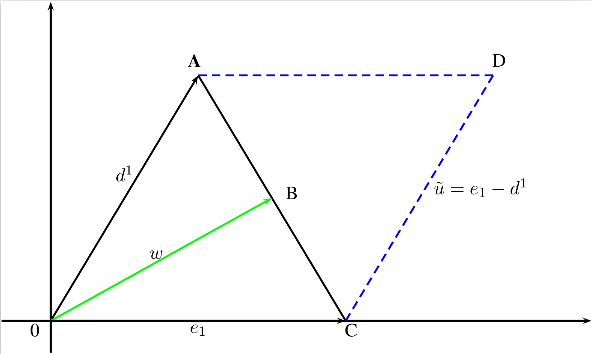

```{r setup, include=FALSE}
library(knitr)
library(bookdown)
knitr::opts_chunk$set(echo = TRUE)
```

```{r include = FALSE}
library(captioner)
fig_nums <- captioner(prefix = "Figure")
fig_nums("figure1", "__View Sample Output__. Use the View command to navigate the tree objects returned by the __fit()__ command.")
fig_nums("figure2", "The householder matrix.")

table_nums <- captioner(prefix = "Table")
table_nums("table1", "Default parameters for model HHDecisionTreeClassifier.")
table_nums("table2", "Overview of the datasets used by @Wickramarachchi+Robertson+Reale+Price+Brown:2019 used in the experiments detailed below. They have all been downloaded from the UCI repository [@Newman+Asuncion:2007].")
table_nums("table3", "Overview of the datasets from @Yang+Shen+Gao:2019 used in the experiments detailed below. They have all been downloaded from the UCI repository [@Newman+Asuncion:2007].")
table_nums("table4", "Default parameters for model HHDecisionTreeRegressor.")
table_nums("table5", "hhcartr: Tree Node variables and descriptions.")
```
<!-- Wickramarachchi et al. (2019) -->

# hhcartr: An implementation of HHCART(G) - A reflected feature space for CART. 

This vignette is intended to provide details of the functions and methods in the hhcartr package. The hhcartr programs build classification or regression models using the HHCART(G) algorithm [@Wickramarachchi+Robertson+Reale+Price+Brown:2019] to induce oblique decision trees.

This vignette is divided into the following sections:

# The HHCART(G) Algorithm

In this section, we will describe HHCART(G) [@Wickramarachchi+Robertson+Reale+Price+Brown:2019] an oblique classification tree algorithm. But first, to place it in context we will review both the HHCART algorithm [@Wickramarachchi+Robertson+Reale+Price+Brown:2015] and the Geometric decision tree (GDT) algorithm [@Manwani+Sastry:2011] as HHCART(G) uses a modified GDT angle bisector to define an alternative reflected feature space for the HHCART algorithm.

## HHCART

HHCART is a comprehensive extension of the work of @Robertson:2013, the HHCART algorithm finds oblique splits which can be linear combinations of both quantitative and qualitative features [@Wickramarachchi+Robertson+Reale+Price+Brown:2015]. We will use a two-class classification problem to explain the concept of HHCART. Although we look at a two-class problem here, the algorithm does generalise to multi-class problems. To split a node, the author's approach is to find a separating hyperplane for each class and to examine the resulting orientation of each. This can be taken as the most stretched direction as represented by the dominant eigenvector from the covariance matrix for each class.

For a set of training examples, the estimated covariance matrix can be defined as follows. Let $x_{1}, x_{2},\dotsc, x_{n}$ be $p$ dimensional feature vectors, where $x_{i} = (x_{i1}, x_{i2},\dotsc, x_{ip})^{T}$ and $p$ the number of feature variables. The estimated covariance matrix can then be written as:

$$S = \frac{1}{n-1} \sum_{i=1}^{n} (x_{i} - \bar{x})(x_{i} - \bar{x})^{T}$$
Where $\bar{x} = (\bar{x}_{1}, \bar{x}_{2},\dotsc, \bar{x}_{p})^{T}$ is a vector of feature column means and $n$, the number of training examples. Given there are two classes, two dominant eigenvectors, $d^{1}$ and $d^{2}$ can be found, one for each class.

A hyperplane, parallel to either $d^{1}$ or $d^{2}$ can be a candidate direction for a class separating hyperplane. If one of the eigenvectors, say $d^{1}$ is reflected such that it becomes parallel to one of the coordinate axes, $e_{1}$, then the orientation of the separating hyperplane will also be parallel to $e_{1}$ in the reflected space. The separating hyperplane can now be found by performing axis-parallel splits along the $e_{2}$ direction in the reflected space [@Wickramarachchi:2015].

### Householder Reflection

The concept of the HHCART algorithm is reflecting the set of training examples using a householder matrix, which was used by @Robertson:2013 to induce space partitions. For a $p$-dimensional space, a householder matrix $H$ can be defined as follows:

Let $d^{1}$ be the normalised dominant eigenvector for the class $1$ training examples with $e_{1_{p\times 1}} = (1, 0, \dotsc, 0)^{T}$ a basis vector. Both vectors, $d^{1}$ and $e_{1}$, will have the same norm. Then there exists an orthogonal symmetric matrix $H_{p\times p}$, with $p$ the number of features, such that:

\begin{align*}
e_{1} &= Hd^{1} \\
\text{where } H &= I - 2uu^{T} 
(\#eq:eqn1) \\
\text{and } u &= \frac{e_{1} - d^{1}}{\lVert{e_{1} - d^{1}}\rVert_{2}} \\
\end{align*}

### Construction of the householder matrix

This section will explain the construction of the householder matrix. Let $d^{1}$ be a vector to be reflected using the matrix $H$ such that $e_{1} = Hd^{1}$. Vectors $d^{1}$ and $e_{1}$ are shown in Figure \@ref(fig:geom1).

```{r geom1, echo=FALSE, out.width = "95%", fig.cap = "Geometry of a Householder Reflection."}

```

Vector $e_{1}$ can be written as the addition of two vectors, $e_{1} = d^{1} + \tilde{u}$, where $\tilde{u} = e_{1} - d^{1}$. From Figure \@ref(fig:geom1) as $e_{1}$ is the reflection of $d^{1}$, we can see that $AB = \lVert{d^{1}}\rVert \cos\theta$ and $AC = 2AB$. Therefore:

\begin{align*}
\tilde{u} &= 2\lVert{d^{1}}\rVert\frac{\tilde{u}}{\lVert{\tilde{u}}\rVert}\cos\theta \\
\text{hence, } e_{1} &= d^{1} + 2\lVert{d^{1}}\rVert\frac{\tilde{u}}{\lVert{\tilde{u}}\rVert}\cos\theta \\
\text{since, } d^{1} \tilde{u} &= \lVert{d^{1}}\rVert\lVert{\tilde{u}}\rVert\cos(\pi - \theta) \\
\text{we have: } \cos\theta &= \frac{d^{1}\cdot\tilde{u}}{\lVert{d^{1}}\rVert\lVert{\tilde{u}}\rVert} \\
\text{and } e_{1} &= d^{1} - 2\lVert{d^{1}}\rVert\frac{\tilde{u}}{\lVert{\tilde{u}}\rVert}\frac{d^{1}\cdot\tilde{u}}{\lVert{d^{1}}\rVert\lVert{\tilde{u}}\rVert} \\
e_{1} &= d^{1} - 2\tilde{u}\frac{\tilde{u}^{T}d^{1}}{\lVert\tilde{u}\rVert_{2}} 
(\#eq:eqn2)
\end{align*}

Since $\tilde{u} = e_{1} - d^{1}$, equation \@ref(eq:eqn1) gives $\tilde{u} = \lVert\tilde{u}\rVert u$. Therefore, substituting $\tilde{u}$ in equation \@ref(eq:eqn2) by $\lVert\tilde{u}\rVert u$ gives:

\begin{align*}
e_{1} &= (I - 2uu^{T})d^{1} \\
\text{that is, } H &= I - 2uu^{T}
\end{align*}

Since the householder matrix, $H_{p\times p}$ is both symmetric and orthogonal, a point in the transformed space can be mapped back to the original space at minimal cost. Let $x$ be a point in the original space, if the transformed point is defined as $\hat{x} = Hx$, multiplying both sides by $H$ gives $H\hat{x} = HHx$. Since $H$ is orthogonal and symmetric, $H^{T} = H^{-1}$, therefore, $HH = I$, where $I$ is the identity matrix. Therefore, $H\hat{x} = x$.

### The householder reflection

Denoting the full set of training examples as $\mathfrak{D}_{n\times p}$, the reflected example set $\hat{\mathfrak{D}}_{n\times p}$, is obtained by multiplying $\mathfrak{D}_{n\times p}$ by the householder matrix $H$.

$$\hat{\mathfrak{D}} = \mathfrak{D}H$$
The mechanism of the householder reflection is that it makes a vector $d^{1}$ parallel to $e_{1}$ by a reflection through the plane perpendicular to vector $e_{1} - d^{1}$. Where $d^{1}, i = 1,\dotsc,p$ is the $i^{th}$ component of $d$. The resulting householder matrix is given in `r fig_nums("figure2", display = "cite")`:

$$
H =
\begin{bmatrix}
d^1_1 & d^1_2 & d^1_3 & \dotsc & d^1_p \\
d^1_2 & 1 - \frac{(d^1_2)^2}{1 - d^1_1} & \frac{-d^1_2 d^1_3}{1 - d^1_1} & \dotsc & \frac{-d^1_2 d^1_p}{1 - d^1_1} \\
d^1_3 & \frac{-d^1_3 d^1_2}{1 - d^1_1} & 1 - \frac{(d^1_3)^2}{1 - d^1_1} & \dotsc & \frac{-d^1_3 d^1_p}{1 - d^1_1} \\
\vdots & \vdots & \vdots & \ddots & \vdots \\
d^1_p & \frac{-d^1_p d^1_2}{1 - d^1_1} & \frac{-d^1_p d^1_3}{1 - d^1_1} & \dotsc & 1 - \frac{(d^1_p)^2}{1 - d^1_1}
\end{bmatrix}
$$
`r fig_nums("figure2")`

Each column of $H$ represents the direction of a coordinate axis in the reflected space. Axis-parallel splits are searched along these axes, the best split found will be oblique in the original feature space. HHCART, by using all possible eigenvectors for reflections creates an enriched axis-parallel search space, which in turn may offer up the opportunity to find better splits.

For a $p$-dimensional classification problem with $C$ classes, there will be $Cp$ eigenvectors to be considered for the householder reflection. This leads to an increase in the time complexity for tree induction but gives an opportunity to produce more accurate and compact trees.

In some instances, the orientation of an eigenvector may be parallel to a feature axis in the original feature space. When this happens, the householder transformation is not required, and hence, the best separating hyperplane is found by performing axis-parallel splits in the original space.

### Householder reflection for multiclass problems

In the case of a multiclass classification problem, the HHCART algorithm works much in the same way as it does for a two-class problem. At a node, eigenvectors are computed for each class. For each eigenvector, a householder matrix is computed, and the reflection performed. Axis-parallel splits are then carried out in each of the reflected spaces, thereby making it possible to find the best split in a reflected space created from a non-dominant eigenvector.

## HHCART(G)

Contrasting with other HHCART tree algorithms, the HHCART(G) algorithm considers only one reflected feature space when splitting nodes. Searching a single feature space ensures HHCART(G) is much less computationally expensive compared to other HHCART tree-based algorithms. For example, to split each node using the HHCART(D) algorithm, $C$ generalised eigenvalue problems need to be solved, as the training examples are reflected $C$ times and $Cp$ splitting dimensions need be searched to find the best split [@Wickramarachchi+Robertson+Reale+Price+Brown:2015]. Contrast this with HHCART(G) where only one generalized eigenvalue problem need be solved, the training examples are reflected just the once, thus allowing the best split to be found after searching only $p$ splitting dimensions.

@Manwani+Sastry:2011 introduced the modified angle bisector which is used by HHCART(G) to define its reflected feature space. Returning to our two-class classification problem, with training examples, $\mathfrak{D}$:

$$\mathfrak{D} = \{(x_{i}, y_{i}): x_{i}\in \Re^{p}, y_{i} \in \{-1, 1\} \text{ and } i = 1, 2,\dotsc, n\}$$
At node t, let $A \in \Re^{n_{A\times p}}$ be a matrix containing training examples where $y_{i}=1$, and let $B \in \Re^{n_{B\times p}}$ be the matrix containing training examples where $y_{i} = -1$. Using a clustering hyperplane, one for each class, the angle bisectors can be defined using the form:

$$w^{T}x + b = 0 
(\#eq:eqn3)$$
Equation \@ref(eq:eqn3) can be written as $\tilde{w}^{T} + \bar{x}$, where $\tilde{w} = (w^{T}, b)^{T}$ and $\bar{x} = (x^{T}, 1)^{T}$. These clustering hyperplanes are chosen such that each hyperplane is closest to all points of one class and is farthest from all points of the other class [@Wickramarachchi+Robertson+Reale+Price+Brown:2019]. Specifically, they are solutions to the following optimization problems:

\begin{align*}
\tilde{w}_{1} &= argmax_{\tilde{w}\neq 0} \frac{\tilde{w}^{T}M\tilde{w}}{\tilde{w}^{T}G\tilde{w}}\notag\\
\text{and } \tilde{w}_{2} &= argmin_{\tilde{w}\neq 0} \frac{\tilde{w}^{T}M\tilde{w}}{\tilde{w}^{T}G\tilde{w}} 
(\#eq:eqn4)  \\
\text{where } M &= \frac{1}{n_{B}}(B, \mathbb{1})^{T}(B, \mathbb{1}) \\
\text{and } G &= \frac{1}{n_{A}}(A, \mathbb{1})^{T}(A, \mathbb{1}) \\
\text{and } \mathbb{1} &= \text{a column vector of ones}
\end{align*}

If matrix $G$ has full column rank, the solution to these optimization problems can be calculated using an LU-decomposition method [@Golub+VanLoan:1996]. The solutions are the eigenvectors corresponding to the maximum and minimum eigenvalues from the following generalised eigenvalue problem [@Manwani+Sastry:2011].

$$M\tilde{w} = \lambda G\tilde{w} 
(\#eq:eqn5)$$
@Manwani+Sastry:2011 have shown for any $\tilde{w}$ that is a local solution of the optimization problem given by equations \@ref(eq:eqn4) and \@ref(eq:eqn4) will satisfy equation \@ref(eq:eqn5), and the eigenvalue $\lambda$ gives the value of the corresponding objective function. Finding the clustering hyperplane parameters, $(w_{1}, b_{1})$ and $(w_{2}, b_{2})$ becomes a problem of finding eigenvectors corresponding to the maximum and minimum eigenvalues of the generalised eigenvalue problem of Eqn \@ref(eq:eqn5). If $\tilde{w}_{1}$ is a solution to Eqn \@ref(eq:eqn5), $k\tilde{w}_{1}$ will be a solution for any $k$. Choosing $k = \frac{1}{\lVert{w_{1}}\rVert}$ gives clustering hyperplanes $\tilde{w}_{1} = (w_{1}^{T}, b_{1})^{T}$ and $\tilde{w}_{2} = (w_{2}^{T}, b_{2})^{T}$ and are unit scaled such that $\lVert{w_{1}}\rVert = \lVert{w_{2}}\rVert = 1$. Upon finding the clustering hyperplanes, the hyperplane associated with the current node will be an angle bisector of this pair of hyperplanes. If $\tilde{w}_{3}^{T}x + b_{3} = 0$ and $\tilde{w}_{4}^{T}x + b_{4} = 0$ are the angle bisectors of $\tilde{w}_{1}^{T}x + b = 0$ and $\tilde{w}_{2}^{T}x + b = 0$, it can be shown when $w_{1} \neq w_{2}$ the clustering hyperplanes are given by:

$$\tilde{w}_{3} = \tilde{w}_{1} + \tilde{w}_{2} 
(\#eq:eqn6)$$
$$\tilde{w}_{4} = \tilde{w}_{1} - \tilde{w}_{2} 
(\#eq:eqn7)$$

In the case when $w_{1} = w_{2}$ the clustering hyperplanes are parallel, the chosen angle bisector will be midway between the two parallel hyperplanes:

$$\tilde{w}_{3} = (\tilde{w}_{1}^{T}, (b_{1} + b_{2})/2)^{T}  
(\#eq:eqn8)$$
The hyperplane Gini index is used to evaluate both hyperplanes at node $t$; it's defined as:

$$Gini(\tilde{w}) = 2L(1 - L_{A})L_{A} + 2(1 - L)(1 - R_{A})R_{A} 
(\#eq:eqn9)$$
Where $L$ is the fraction of points at the left descendent node when using split $\tilde{w}$ and $L_{A}(R_{A})$ is the fraction of samples at the left(right) node from Matrix A. The angle bisector with the least impurity as measured by the Gini index is chosen to split the node [@Manwani+Sastry:2011]. The best angle bisector to split node $t$ is then used to define a reflected feature space; specifically, the training examples at node $t$ are reflected using the householder matrix so that the normal vector of the angle bisector $w$ is parallel to the first coordinate axis $e$.

Using the reflected training examples $\hat{D}^{t}$, we find the axis-parallel split $s^{t}$ that minimises the split Gini index:

\begin{align*}
Gini(\tilde{s}) = L \sum_{k=1}^{C} P_{lk}(1 - P_{lk}) + (1 - L) \sum_{k=1}^{C} P_{rk}(1 - P_{rk})   (\#eq:eqn10)
\end{align*}

Where $L$ is the fraction of points that will go to the left descendent node after the split and $P_{lk}(P_{rk})$ is the fraction of points at the left(right) node from class $k$ [@Wickramarachchi+Robertson+Reale+Price+Brown:2019].

An exhaustive search over all $p$ dimensions is performed to find the best split. This can be done quickly and efficiently as each dimension is independent and as such, can be treated separately, thereby making the search embarrassingly parallel [@Wickramarachchi+Robertson+Reale+Price+Brown:2019]. The best axis-parallel split in the reflected feature space can be denoted $z_{j} \leq s^{t}$ (the $j^{th}$ coordinate direction in the reflected feature space). In the original feature space, this split is oblique and given by $h_{j}^{T}x \leq s^{t}$, where $h_{j}$ is the $j^{th}$ column of the householder matrix $H$.

This method is run recursively on all descendent nodes until no further splitting is possible or specific stopping conditions are satisfied. These stopping conditions relate to two user-specified parameters used by the HHCART(G) algorithm. Specifically, these are, __n_min__ the minimum number of training examples, implemented in the __hhcartr__ package as the __n_min__ parameter and $\epsilon$, the minimum node impurity, the equivalent parameter in the __hhcartr__ package is __min_node_impurity__. The default values as implemented in __hhcartr__ are __n_min = 2__ and __min_node_impurity = 0.2__. In our experiments, we use ten-fold cross-validation to choose an appropriate value for $\epsilon$ as suggested by @Manwani+Sastry:2011.

During tree induction, if there are fewer than $n_{min}$ training examples at a node or if the node's Gini index is less than $\epsilon$, the node becomes a terminal or leaf node, the majority class becomes the class label for the node. In the event of a tie, the majority class is chosen at random from among the tied classes.

## Small sample sizes

During tree induction, the number of training examples at each node reduces with each split, which can result in several issues as this number becomes small. The most apparent issue is one of computational cost; would an axis-parallel split be more efficient when the number of training examples is small? rather than creating and searching an oblique split? This cost is a common problem for any oblique decision tree, for instance, to address this issue in the OC1 algorithm, the authors @OC1:1993 only use oblique splits when the number of training examples at a node exceeds the number of feature variables by a factor of two.

Another issue that is less obvious and is wholly dependent upon the nature of the data in the training examples. A small number of training examples at a node can result in matrix $G$ becoming rank deficient and as such LU-decomposition will not work. In this case, @Manwani+Sastry:2011 address this issue by defining the angle bisector as the eigenvector corresponding to the largest eigenvalue of:

$$\tilde{M} = QQ^{T}MQQ^{T}$$

Where $Q$ is a matrix whose columns are an orthogonal basis for the $null(G)$. However, if $null(G) \in null(M)$, $\tilde{M}$ will be the zero matrix, and the method fails \citep{Wickramarachchi+Robertson+Reale+Price+Brown:2019}. \cite{Wickramarachchi+Robertson+Reale+Price+Brown:2015} provide a solution for this special case, they define $\tilde{w} = u + v$, where $u \in range(G)$ and $v \in null(G)$, then the left optimization in equation \@ref(eq:eqn4) [@Wickramarachchi+Robertson+Reale+Price+Brown:2015] becomes:

\begin{align*}
\tilde{w}_{1} &= argmax_{\tilde{w}\neq 0} \frac{(u+v)^{T}M(u+v)}{(u+v)^{T}G(u+v)} \\
              &= argmax_{u \neq 0} \frac{u^{T}Mu}{u^{T}Gu}
\end{align*}

because $v \in null(G)$ with $null(G) \subseteq null(M)$ and values of $u$ giving $u^{T}Gu = 0$ are avoided. The right optimization in equation \@ref(eq:eqn4) is solved in similar fashion. Define $\tilde{w} = u + v$, where $u \in range(M)$ and $v \in null(M)$. Then, the right optimization in equation \@ref(eq:eqn4) \citep{Wickramarachchi+Robertson+Reale+Price+Brown:2015} becomes:

\begin{align*}
\tilde{w}_{2} &= argmax_{\tilde{w}\neq 0} \frac{(u+v)^{T}G(u+v)}{(u+v)^{T}M(u+v)} \\
              &= argmax_{u \neq 0} \frac{u^{T}Gu}{u^{T}Mu}
\end{align*}

because $v \in null(M)$ with $null(m) \supseteq null(G)$ and values of $u$ giving $u^{T}Mu = 0$ are avoided. The angle bisectors $\tilde{w}_{1}$ and $\tilde{w}_{2}$ are calculated using \@ref(eq:eqn7), and the hyperplane with the lower hyperplane Gini index is chosen to split the node. If $\tilde{w}_{1}$ and $\tilde{w}_{2}$ are parallel, the angle bisector becomes \@ref(eq:eqn6).


# Usage of hhcartr

We now demonstrate the use of __hhcartr__ by illustrating the use of the __HHDecisionTreeClassifier()__ function. We will use the supplied dataset __hhcart_segment__ from __hhcartr__ to ensure the examples are readily repeatable. See the help page of __hhcartr__ in __R__ for more details on the dataset. We begin by loading the required packages into __R__, assuming they have been installed (using install.packages()).

```{r library, echo=TRUE}
library("hhcartr")
library("ggplot2")
```
The first step is to load the dataset, then the feature variables (X) and target variable (y)
can be initialised. In the case of the __hhcart_segment__ dataset, the X variable is created from
columns 2-20 from the original UCI dataset and y is created from column 1 of the same. The __hhcart_segment__ dataset also provides it's own test dataset.

```{r loaddata, echo=TRUE}
data("cancer", package = "hhcartr")
X         <- segment$X
y         <- segment$y
test_data <- segment$test_data
```
Once you have established the dataset, it is advisable to summarize the basic dataset information.

```{r eda1, echo=TRUE}
dim(X)
names(X)
```

If is also useful to review the output of the summary(), head(), tail() and str() functions
on the dataset but we will skip this here for the sake of brevity. Before building the model
we need to prepare the training dataset, specifically identifying the variables to ignore in the
modelling. Identifiers and any output variables should not be used (as independent variables)
for modelling. In the case of datasets supplied with __hhcartr__ all appropriate variables are
assigned to the X and y objects of the dataset. Next we deal with missing values. Currently
this implementation does not support data with missing values. In the supplied datasets
with __hhcartr__ there are no missing values. It is useful to review the distribution of the target variable.

```{r eda2, echo=TRUE}
table(y)
```

## Demonstrate Model HHDecisionTreeClassifier

We now instantiate the chosen model. The aim of the model is to predict the target based
on all other variables.

```{r model1, echo=TRUE}
model <- HHDecisionTree(n_folds=10, min_node_impurity = 0.22)
```

We use function __setDataDescription()__ to provide the data source in all subsequent display
command outputs. The __dataDescription__ parameter of the model __HHDecisionTreeClassifier()__
can also be used to provide a descriptive name for the data source.

```{r setDataDescription, echo=TRUE}
setDataDescription("Segmentation")
```

We now set a seed so that the results can be replicated exactly.

```{r setseed, echo=TRUE}
set.seed(2020)
```

We are now ready to train the model, initiate training by passing the feature variables (X object) and the target variable (y object) to the model __fit()__ function.

```{r modelfit, echo=TRUE}
model.output <- model$fit(X, y)
```

After the tree building process has completed, results detailing accuracy, the number of nodes
and the number of leaves per tree can be displayed for each fold by using the __results()__
function. The output of this function can also be saved in a variable for future processing
such as plotting.

```{r results1, echo=TRUE}
res <- results(model.output)
```

The __accuracy()__ method of the results object can be used to display the accuracy, the number of nodes and the number of leaves per tree for each fold. These are saved in a list and are accessible for future plotting. The accuracy, the mean over all __n_folds__, reported here is the accuracy achieved on each folds test dataset,

```{r accuracy1, echo=TRUE}
res$accuracy()
```

The __margin()__ method of the results object can be used to display the margin for each tree on each fold. @Breiman:2001 defines the margin for a random forest as:

$$mg(\underline{X}, Y) = \frac{\sum_{k=1}^{K} I(h_{K}(\underline{X}) = Y)}{K} - max_{j \neq Y} \left[ \frac{\sum_{k=1}^{K} I(h_{K}(\underline{X}) = j)}{K} \right]$$

Where $I(\cdot)$ is the indicator function, $h_{1},\dotsc, h_{K}(\underline{x})$ is a collection of classifiers, with $Y, \underline{X}$ a random vector sampled from the training data. The margin of a single tree is defined as the proportion of correctly classified samples minus the proportion of the most misclassified class. Thus for a single tree, the margin can be written as:

$$mg(\underline{X}, Y) = \frac{I(h_{K}(\underline{X}) = Y)}{K} - max_{j \neq Y} \left[ \frac{ I(h_{K}(\underline{X}) = j)}{K} \right]$$

```{r margin1, echo=TRUE}
res$margin()
```

The __print()__ function is used to visualise training accuracy results on a histogram plot, the
plot is rendered using __ggplot2__ [@ggplot2]. A 95% confidence interval about the mean
is also displayed.

```{r print1, echo=TRUE, fig.align="center", fig.width = 8, fig.height = 6, fig.cap = "Classification accuracy for 10-folds after training on the Segmentation dataset."}
print(model.output)
```

The standard __predict()__ function is available to apply new data to the model. The Segmentation
dataset provides a 2,100 sample test dataset. Here we apply this test dataset loaded previously (see above) to obtain the mean prediction accuracy for each fold. The object returned by the __predict()__ function supports both an __accuracy__ and __predictions__ method.

```{r predict1, echo=TRUE}
preds <- predict(model.output, test_data = test_data)
```

The __accuracy__ method returns a data frame containing the accuracy values for each fold, this object can be saved as a variable. The prediction accuracy returned is displayed as a percentage.

```{r accuracy1b, echo=TRUE}
preds$accuracy()
```

The __predictions__ method returns a data frame containing the predictions for each row of the
__test_data__ object, each column provides the prediction for each fold for each respective row,
this object can be saved as a variable. The __options(max.print=50)__ limits the output display
of predictions to the first few rows.

```{r predictions1a, echo=TRUE}
options(max.print=50)
preds$predictions()
```

A single tree, or indeed all trees induced by the model can be visualized using the
__displayTree()__ function, it takes a single parameter __n__, the $n^{th}$ tree to display. The
__hhcartr__ package generates __DOT__ [@Gansner+Koutsofios+North+Vo:1993] language statements to describe the structure of the selected tree, the __DOT__ language statements are written
to a temporary dataset and displayed using the __grViz()__ function from the __DiagrammeR__
package [@diagrammer].

```{r grviz1, echo=TRUE, fig.align="center", fig.width = 7, fig.height = 6, fig.cap = "Plot of Tree 1 from the HHDecisionTreeClassifier model trained on the Segmentation dataset."}
library(DiagrammeRsvg)
library(rsvg)
outp <- displayTree(1)
grViz(unlist(outp))
```

We have a model that is close to __84.0%__ accurate on the unseen test dataset. In the invocations we have demonstrated above, all parameters except __min_node_impurity__ use their default values.


# Models
The R package __hhcartr__ supports the following models.

## HHDecisionTreeClassifier
The __hhcartr__ model __HHDecisionTreeClassifier__ is used for classification problems. is used to induce regression trees.

When a __HHDecisionTreeClassifier__ model is first instantiated the package __checkmate__ [@checkmate] is used to parse all provided parameter values; the function will terminate with
an appropriate error message on the first parameter to fail validation. Input is passed to the
__HHDecisionTreeClassifier__ model by way of feature variables (X) and target variable (y)
as separate objects to the __fit__ method. The feature variables (X) can be either a dataframe
or a matrix of numeric data, categorical feature variables are not yet supported, whereas the
target variable (y) must be of type factor. The model __fit__ method will terminate with an
appropriate error message if input type validation fails. The __hhcartr__ package does not yet
support NA’s in the input data.

## HHDecisionTreeRegressor
The __hhcartr__ model __HHDecisionTreeRegressor__ is used to induce regression trees. These predict a real number rather than a class. Splits are looked for that minimise the prediction squared error, the prediction at each leaf node being the mean for that node. Internally the model uses parameter __useIdentity=TRUE__ which forces all splits to be axis-parallel. 

When a __HHDecisionTreeRegressor__ model is first instantiated the package __checkmate__ [@checkmate] is used to parse all provided parameter values; the function will terminate with
an appropriate error message on the first parameter to fail validation. Input is passed to the
__HHDecisionTreeRegressor__ model by way of feature variables (X) and target variable (y)
as separate objects to the __fit__ method. The feature variables (X) can be either a dataframe
or a matrix of numeric data, categorical feature variables are not yet supported, whereas the
target variable (y) must be of type numeric. The model __fit__ method will terminate with an
appropriate error message if input type validation fails. The __hhcartr__ package does not yet
support NA’s in the input data.

## Model Parameters

The following section describes the common model parameters i.e. parameters that can be specified for any of the _hhcartr_ supported models, namely:

* HHDecisionTreeClassifier
* HHDecisionTreeRegressor

### Common Model Parameters

The following parameters may be specified on any _hhcartr_ model.

1. __n_min__
    This parameter is used to stop splitting a node when a minimum number of samples at that node has been reached. The default value is 2.
    
2. __n_trees__
    The number of trees to induce(grow) per fold or trial. The default value is 1.
    
3. __n_folds__
    The __n_folds__ parameter is used to specify the number of folds to use i.e. split the input data into __n_folds__ equal amounts. For __n_folds__ times, use one portion of the input data as a test dataset, and the remaining __n_folds-1__ portion as the training dataset. The model is then trained using these training and test datasets, once training is complete the next fold or portion of the input dataset is treated as the test dataset and the remainder the training dataset, the model is then trained again. This process is repeated until all portions or folds of the input dataset have been used as a test dataset. When __n_folds=1__ the __testSize__ parameter determines the size of the test dataset. The default value is 5.

4. __testSize__ 
    The __testSize__ parameter determines how much of the input dataset is to reserved for use as an internal test dataset. The remainder is used as the training dataset. This parameter is only used when the parameter __n_folds=1__. For values of __n_folds__ greater than one, the computed fold size will govern the test dataset size used (see the __n_folds__ parameter for more details). The value can have a range of 0.0 to 1.0, the default value is 0.2.
    
5. __dataDescription__
    The __dataDescription__ parameter is a short description used to describe the dataset being modelled. It is used in output displays and plots as documentation. The default value is __Unknown__.
    
### HHDecisionTreeClassifier Model Parameters

The model HHDecisionTreeClassifier model supports the common model parameters as described above, as well as the following model specific parameters (with default values).

1. __min_node_impurity__
    Node splitting stops if the node impurity falls below this threshold. The node impurity is calculated using the hyperplane Gini index. The default value is 0.2.
    
2. __useIdentity__
    The __useIdentity__ parameter when set __TRUE__ will direct _hhcartr_ to transform the training data using the identity matrix (no actual transform takes place) prior to finding the optimal splits rather than using the householder transform to reflect the data. The default value is __FALSE__.
    
`r table_nums("table1", display = "cite")` provides a summary of the default parameters for model HHDecisionTreeClassifier.

 | Parameter             | Default value |
 |:----------------------|--------------:|
 | n_min                 | 2             |
 | min_node_impurity     | 0.2           |
 | n_trees               | 1             |
 | n_folds               | 5             |
 | testSize              | 0.2           |
 | useIdentity           | FALSE         |
 | dataDescription       | Unknown       |

Table: `r table_nums("table1")`

### HHDecisionTreeRegressor Model Parameters

The model HHDecisionTreeRegressor model supports just the common model parameters as described above.

`r table_nums("table4", display = "cite")` provides a summary of the default parameters for model HHDecisionTreeClassifier.

 | Parameter             | Default value |
 |:----------------------|--------------:|
 | n_min                 | 2             |
 | n_trees               | 1             |
 | n_folds               | 5             |
 | testSize              | 0.2           |
 | dataDescription       | Unknown       |

Table: `r table_nums("table4")`


## General Commands

The following functions, demonstrated above, can be applied to all __hhcartr__ models, __fit()__, __results()__, __print()__, and __predict()__. The __results()__ function provides the __accuracy()__ and __margin()__ methods, the function __predict()__ supports the __accuracy()__ and __predictions()__ methods. General functions __setDataDescription()__ and __displayTree()__ are also part of the __hhcartr__ package. The __HHDecisionTreeRegressor__ model does not yet support the __margin()__ method.

### HHDecisionTreeRegressor()

As demonstrated above the print() function on the results from the HHDecisionTreeClassifier model returns the model accuracy, whereas for the HHDecisionTreeRegressor model the $r^{2}$ and root mean sqaure error (RMSE) are returned along with the number of nodes and the number of leaves for each tree.

The $r^{2}$ or coefficient of determination value is the ratio of explained variation over the total variation, it will have a value between 0.0 and 1.0. The $r^{2}$ value is computed as follows:

$$R^{2} \equiv  1 - \frac{SS_{res}}{SS_{tot}}$$

where:

$$SS_{tot} =  \sum_{i} (y_{i} - \overline{y})^{2}$$

$$SS_{res} = \sum_{i} (y_{i} - f_{i})^{2}$$

with: $\overline{y}$ = mean of observed data, and $f_{i}$ = predicted values.

## Visualizing the Tree Structure

As the __displayTree()__ function can be used to display the structure of an induced tree, __R__'s __View()__ function can be used to display the internal structure of all tree's returned by the __fit()__ function. This internal tree structure is comprised of a binary tree of S3 objects, this structure can be accessed programmatically by the user.


# hhcartr Supplied Datasets

The __hhcartr__ package provides a number of datasets, the same as those used by the authors
of the HHCART(G) package [@Wickramarachchi+Robertson+Reale+Price+Brown:2019] and includes several bench-mark datasets downloaded from the UCI Machine Learning Repository [@Newman+Asuncion:2007] as used by @Yang+Shen+Gao:2019. See the help page of __hhcartr__ in __R__ for a description of each dataset
using the appropriate __?__ _hhcartr dataset name_ command.
`r table_nums("table2", display = "cite")` and `r table_nums("table3", display = "cite")` provide an overview of the datasets, with the size of the corresponding
CSV (comma separated values) file of each. They also provide the name of the dataset as supplied in the __hhcartr__ package. 

Dataset             | Features | Classes | Examples | hhcartr dataset name |
:-------------------|:--------:|:-------:|:--------:|:---------------------|                
Balance scale (BS)  | 4        | 3       | 625      | hhcartr_balance      |
Boston housing (BH) | 13       | 2       | 506      | hhcartr_boston       |
Breast cancer (BC)  | 9        | 2       | 638      | hhcartr_cancer       |
BUPA                | 6        | 2       | 345      | hhcartr_bupa         |
Glass (GLS)         | 9        | 7       | 214      | hhcartr_glass        |
Pima Indians (PIMA) | 8        | 2       | 768      | hhcartr_pima         | 
Wine (WINE)         | 13       | 3       | 178      | hhcartr_wine         |
Survival (SUR)      | 3        | 2       | 306      | hhcartr_survival     |
Heart (HRT)         | 13       | 2       | 270      | hhcartr_heart        |
Letter (LET)        | 16       | 26      | 20,000   | hhcartr_letters      |

Table: `r table_nums("table2")`

Dataset            | Features | Classes | Examples | Test Examples | hhcartr dataset name |
:------------------|:--------:|:-------:|:--------:|:-------------:|:---------------------|
Landsat (LS)       | 36       | 7       | 4435     | 2000          | hhcartr_landsat      |
Pendigits (PEN)    | 16       | 10      | 7494     | 3498          | hhcartr_pendigits    |
Segmentation (SEG) | 19       | 7       | 210      | 2100          | hhcartr_segment      |
Shuttle (SHUT)     | 9        | 7       | 43,500   | 14,500        | hhcartr_shuttle      |
Vehicle (VEH)      | 18       | 2       | 846      | -             | hhcartr_vehicle      |

Table: `r table_nums("table3")`


The data is not preprocessed, filtered or normalised, that is, all datasets are provided as-is after downloading from the UCI machine learning repository, with the following exceptions. In the glass identification (GLS) dataset [@Evett+Spiehler:1987] the Id number column is not provided, as is the case with the original Wisconsin breast cancer (BC) dataset [@cancer:1990]. Traditionally, the Boston housing (BH) dataset [@boston:1978] is used with regression algorithms, to turn it into a binary classification problem, we created a new target variable using the condition MEDV > 20. As supplied, the landsat (LS) dataset [@Dua+Graff:2019] does not have any examples of class six. Currently this implementation does not support data with missing values. In the supplied datasets with __hhcartr__ there are no missing values. Test data sets are provided for the following datasets: __segment__, __pendigits__, __landsat__ and __shuttle__.


# A Tree Node

In __hhcartr__, each tree node is represented by a hash object, from the __hash__ package [@hash]. Thus each generated tree is represented as a tree structure of hash objects. Each hash object or tree node contains the following information, see `r table_nums("table5", display = "cite")` below:


Variable                  | Description                                                               |
:-------------------------|:--------------------------------------------------------------------------|
__node_gini__                 | The gini-index for this node.|
__node_tot_samples__          | The total number of samples assigned to this node.|
__node_num_samples_per_class__| The number of samples for each class at this node. This will sum to       node_tot_samples.|
__node_predicted_class__      | The predicted class for this node. |
__node_feature_index__        | The column number in either the householder matrix or original dataset used to determine the split for this node. |
__node_threshold__            | The value of the feature used to determine the split at the current node. The feature column used to make the split can be found in node variable __node_feature_index__.|
__node_householder_matrix__   | The householder matrix associated with this node. This need only be the __node_feature_index__ column of the householder matrix. This will be updated at a later date. |
__node_children_left__        | The node containing the samples when the parent node is split i.e. those samples that have values in the __node_feature_index__ column that are less than the __node_threshold_value__.|
__node_children_right__       | The node containing the samples when the parent node is split i.e. those samples that have values in the __node_feature_index__ column that are equal or greater than the __node_threshold value__. |
__node_parent__               | The parent node |
__node_parentid__             | The objectid of the parent node. |
__node_objectid__             | The nodes objectid. Nodes are number sequentially as they are created, with the root node having an objectid of zero.|
__node_type__                 | The type of node, can take values of “DECISION” or “TERMINAL”. A “DECISION” node has a splitting rule and a “TERMINAL” or leaf node is a node that will not be split any further as it is either pure (all the same class) or the splitting stop criteria has been meet i.e. the __n_min__ value and __min_node_impurity__ values are less than the specified parameter values. See below for further discussion on terminal node creation. |
__node_using_householder__    | A flag indicating that this node was split using the householder matrix. This field can have a value of either TRUE or FALSE. |
__node_children_left_NA__     | A flag indicating whether or not the __node_children_left__ field contains “NA”. This field can have a value of either TRUE or FALSE. A value of TRUE indicates this node has no children. If __node_children_left_NA__ and __node_children_right_NA__ are both TRUE this implies that this node is a TERMINAL node. |
__node_children_right_NA__    | A flag indicating whether or not the __node_children_right__ field contains “NA”. This field can have a value of either TRUE or FALSE. A value of TRUE indicates this node has no children. If __node_children_left_NA__ and __node_children_right_NA__ are both TRUE this implies that this node is a TERMINAL node. |
__node_oob_training_indices__ | A list of indices of the out-of-bag samples in the training set used to create this tree. These samples have not been used to grow the tree, but if parameter __OOBEE__ (available in the __HHRandomForestClassifier__ model, which will be available in the next release of __hhcartr__) is TRUE they will be used to calculate the out-of-bag error estimate. Only the root node of a tree will contain valid values; for all other nodes in the tree this field will contain a value of “NA”. This field is only used by the __HHRandomForestClassifier__ model. |
__node_depth__              | The depth in the tree at which this node occurs. At the time of writing this field is not referenced by any __hhcartr__ functionality. |  

Table: `r table_nums("table5")`

## Terminal Node Creation

In __hhcartr__, terminal nodes are created during the tree induction process in either of two ways, firstly through user specified parameters or by forced terminal node creation.

### User parameters

The __hhcartr__ parameters that control the creation of a tree terminal node are __n_min__ and __min_node_impurity__. These parameters have been previously defined above.

### Forced node creation

During the node splitting process, if either of the following conditions arise the splitting process on the current node terminates and a terminal node is created, irrespective of the values of __n_min__ and __min_node_impurity__. These conditions are as follows:

1. __Feature values the same__
    In the situation where all values in a feature column are the same and this pattern is observed for each of the other feature columns, thus making it impossible to find a valid split on any feature column.
    
2. __Single sample__
    In the situation where there are two classes in the node under consideration with one of the classes having only one sample. This situation generally occurs when there are a small number of samples at the node, but __min_node_impurity__ has not quite been reached.
    

# References
